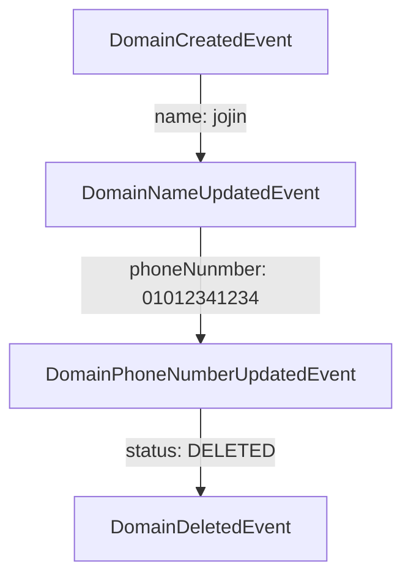

# Event Sourcing & CQRS

이벤트 소싱 & CQRS 소개

---
theme: seriph
class: 'center'
highlighter: shiki
linNumber: false
---

# 이벤트 소싱이란?
이벤트 소싱의 정의

데이터의 현재상태만을 업데이트하여 유지하는 기존의 방식과는 달리

이벤트 소싱이란 도메인 모델에서 발생하는 모든 이벤트를 저장하는 데이터 저장 기법

도메인의 이벤트를 replay하여 현재의 상태를 load

<br><br><br><br><br><br><br><br><br>

<footer>

> Learn More
>  
> [Martin Fowler](https://martinfowler.com/eaaDev/EventSourcing.html)
> 
> [MS Docs](https://docs.microsoft.com/en-us/azure/architecture/patterns/event-sourcing)

</footer> 

---
theme: seriph
highlighter: shiki
linNumber: false
---

# 도메인 이벤트 예시

<div class="grid grid-cols-3 gap-10 pt-4 -mb-6">



<div>

```
{
  "member": {
    "id":"choddol"
    "name": "jinyoung",
    "phoneNumber": "01011112222",
    "status": "CREATED"
  }
}
```

replay 후

```
{
  "member": {
    "id": "choddol"
    "name": "jojin",
    "phoneNumber": "01012341234",
    "status": "DELETED"
  }
}
```

</div>


</div>

---


